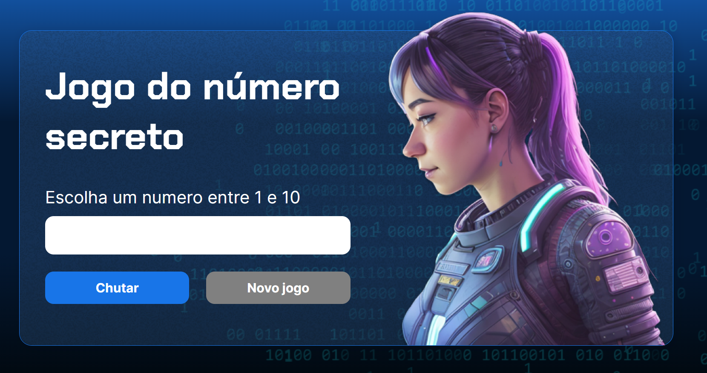

# PROJETO: JOGO DO NÚMERO SECRETO

## Sobre:
- O presente projeto foi desenvolvido durante o curso: "Lógica de programação", da Alura. O objetivo do jogo é descobrir o número secreto, que está entre 1 e 10. O jogo dá dicas para tornar a advinhação mais fácil quando o usuário erra o chute. Há também uma leitura automática feita através de uma voz em português brasileiro.

## Tecnologias utilizadas:

  
  
  

